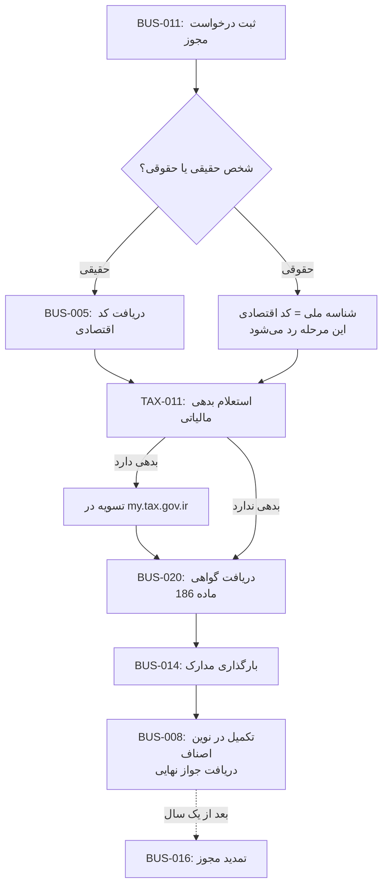

# فرآیند کامل جواز تاسیس / پروانه کسب

این صفحه مسیر کامل و ترتیب درست خدمات مرتبط با صدور جواز کسب را نشان می‌دهد. روی هر باکس کلیک کنید تا مستقیم به راهنمای گام‌به‌گام همان خدمت بروید.

## توضیح مراحل به ترتیب

1. **BUS-011** — ثبت درخواست اولیه در mojavez.ir
2. **تفکیک شرطی**: اگر مشتری شخص حقیقی است → BUS-005 (کد اقتصادی) لازم است. اگر شرکت است، این مرحله رد می‌شود چون کد اقتصادی همان شناسه ملی است.
3. **TAX-011** — استعلام بدهی مالیاتی (پیش‌نیاز اجباری قبل از مرحله بعد)
4. **شرط**: اگر بدهی دارد، باید ابتدا تسویه شود؛ سپس ادامه.
5. **BUS-020** — دریافت گواهی ماده ۱۸۶ (بدون این گواهی، مرحله بعد ممکن نیست)
6. **BUS-014** — بارگذاری مدارک تکمیلی
7. **BUS-008** — تکمیل نهایی در سامانه نوین اصناف و دریافت جواز
8. **BUS-016** — یک سال بعد، برای تمدید (چرخه تکرارشونده)

## نکته برای اپراتور
اگر مشتری در وسط این مسیر گیر کرد (مثلاً بدهی مالیاتی غیرمنتظره داشت)، برگردید به همان مرحله شرطی — این توقف طبیعی است، نه خطا.
