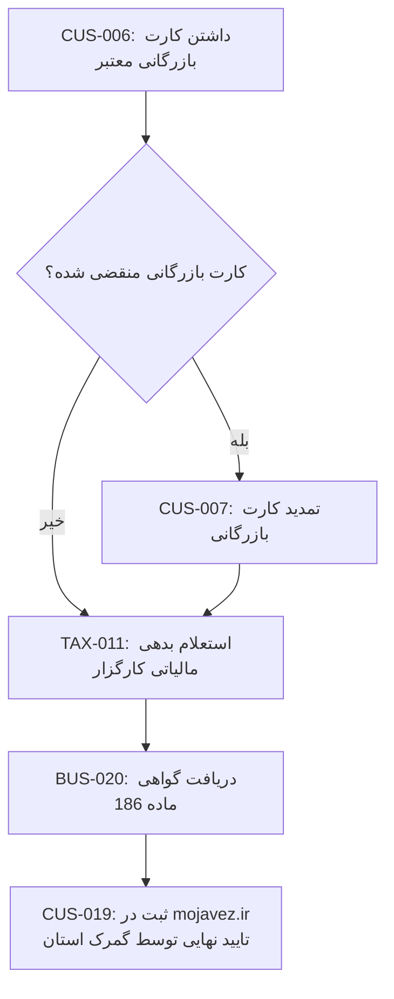

# فرآیند تمدید پروانه کارگزاری (حق‌العمل‌کاری) گمرکی

## توضیح مراحل به ترتیب

1. **CUS-006** — شرط پایه: کارگزار باید کارت بازرگانی معتبر داشته باشد
2. **شرط**: اگر کارت بازرگانی منقضی شده، ابتدا **CUS-007** (تمدید) انجام شود
3. **TAX-011** — استعلام بدهی مالیاتی کارگزار
4. **BUS-020** — دریافت گواهی ماده ۱۸۶ (پیش‌نیاز اجباری، بدون آن گمرک درخواست را رد می‌کند)
5. **CUS-019** — ثبت درخواست در mojavez.ir و تایید نهایی توسط **گمرک استان محل سکونت کارگزار** (نه گمرک مرکزی)

## نکته برای اپراتور
این خدمت کم‌تکرار ولی پردرآمد است. بزرگ‌ترین ریسک، عدم هماهنگی بین اعتبار کارت بازرگانی و پروانه کارگزاری است — این دو باید هم‌زمان معتبر بمانند، وگرنه کل فرآیند از مرحله ۱ باید تکرار شود.
