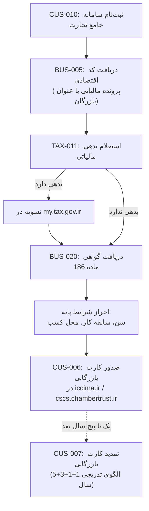

# فرآیند کامل کارت بازرگانی (شخص حقیقی)

## توضیح مراحل به ترتیب

1. **CUS-010** — ثبت‌نام اولیه در سامانه جامع تجارت (پیش‌نیاز همه‌چیز)
2. **BUS-005** — تشکیل پرونده مالیاتی با عنوان «بازرگان» و دریافت کد اقتصادی
3. **TAX-011** — استعلام بدهی مالیاتی
4. **شرط**: اگر بدهی دارد، ابتدا تسویه؛ سپس ادامه
5. **BUS-020** — دریافت گواهی ماده ۱۸۶ (پیش‌نیاز اجباری کارت بازرگانی)
6. **احراز شرایط پایه** — سن (۲۴+)، سابقه کار بازرگانی یا مدرک مرتبط، محل کسب
7. **CUS-006** — صدور نهایی کارت
8. **CUS-007** — تمدید‌های بعدی، با الگوی تدریجی مدت اعتبار

## نکته برای اپراتور
یک شخص هم‌زمان نمی‌تواند هم کارت حقیقی هم حقوقی فعال داشته باشد — این را در همان قدم اول (CUS-010) از مشتری بپرسید.
