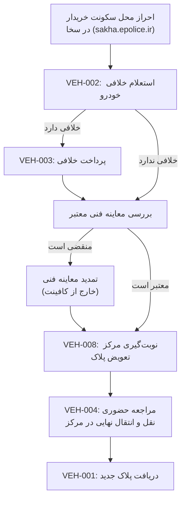

# فرآیند کامل نقل و انتقال خودرو

## توضیح مراحل به ترتیب

1. **احراز محل سکونت خریدار** — پیش‌نیاز اجباری در سخا؛ بدون آن ادامه ممکن نیست
2. **VEH-002** — استعلام خلافی خودرو
3. **شرط**: اگر خلافی دارد → VEH-003 (پرداخت)؛ حذف بدهی از سامانه ۲۴-۷۲ ساعت طول می‌کشد
4. **بررسی معاینه فنی** — اگر منقضی، باید قبل از ادامه تمدید شود (این کار خارج از توان کافینت است، فقط راهنمایی می‌شود)
5. **VEH-008** — نوبت‌گیری مرکز تعویض پلاک
6. **VEH-004** — مراجعه حضوری برای تکمیل نهایی (این مرحله کاملاً حضوری است، کافینت نمی‌تواند جایگزین شود)
7. **VEH-001** — دریافت پلاک جدید

## نکته برای اپراتور
این فرآیند برخلاف دو نمونه قبلی، **همیشه به یک مرحله حضوری اجباری** ختم می‌شود (VEH-004) — کافینت فقط می‌تواند مراحل ۱ تا ۵ را آنلاین انجام دهد و مشتری را برای مرحله نهایی آماده کند.
